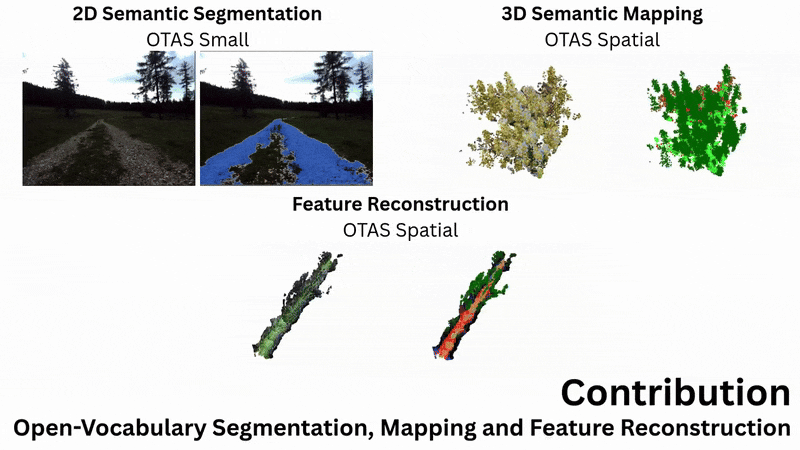
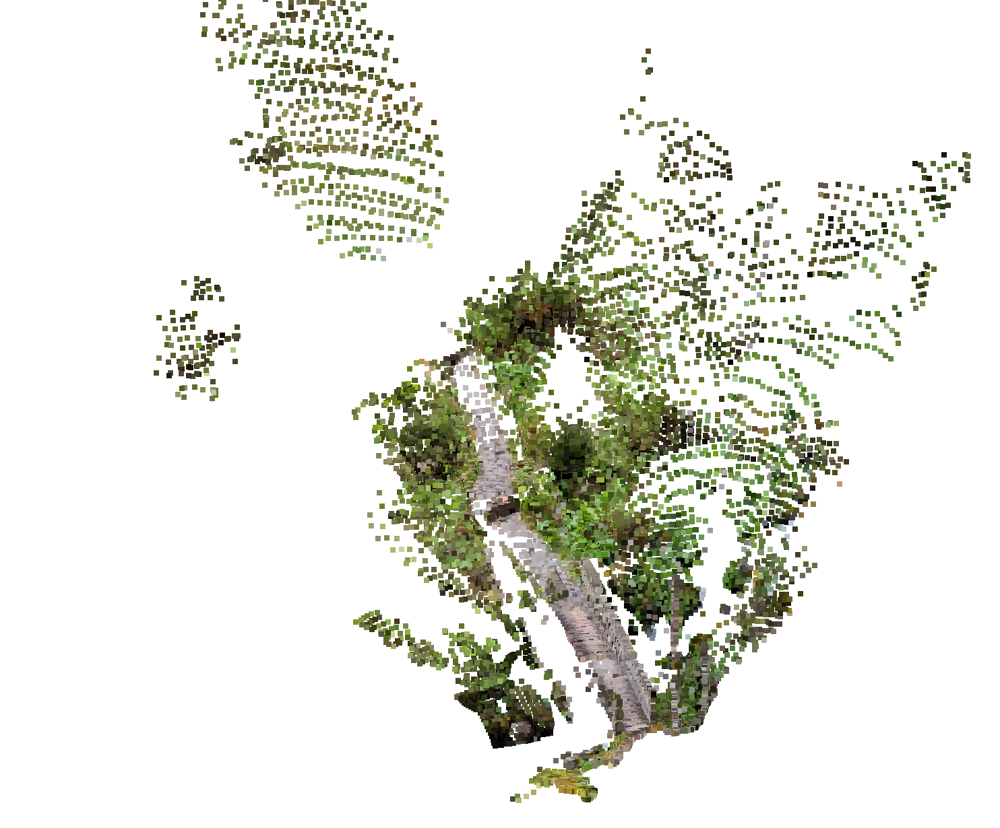
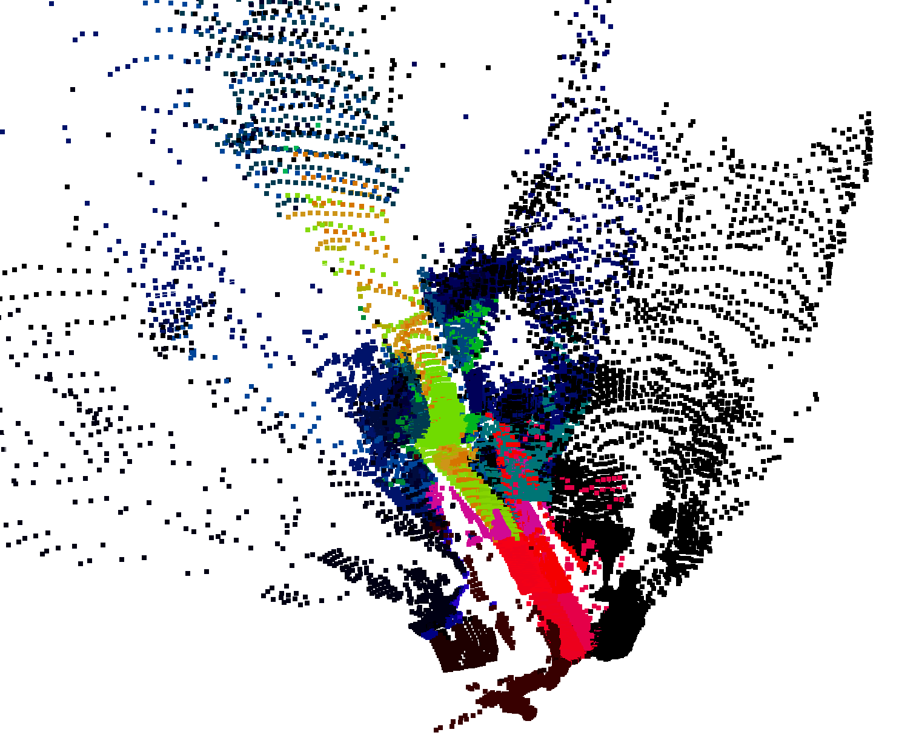
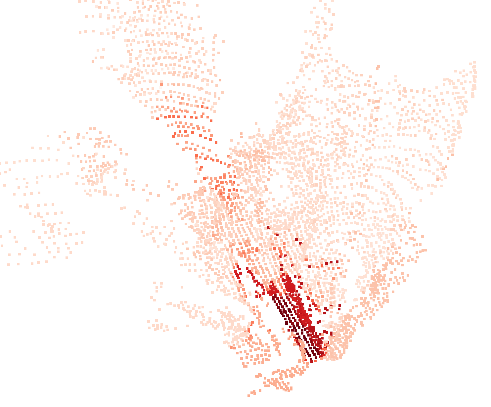

<h1 align="center">
OTAS: Open-vocabulary Token Alignment for Outdoor Segmentation
</h1>

<h3 align="center">
Simon Schwaiger<sup>1,2</sup>, Stefan Thalhammer<sup>2</sup>, Wilfried Wöber<sup>2,3</sup> and Gerald Steinbauer-Wagner<sup>1</sup>
</h3>

<p align="center">
<sup>1</sup>Graz University of Technology<br>
<sup>2</sup>University of Applied Sciences Technikum Wien<br>
<sup>3</sup>University of Natural Resources and Life Sciences Vienna
</p>

<p align="center">
🌐 <a href="https://otas-segmentation.github.io">otas-segmentation.github.io</a>
</p>

***************************************

<div style="max-width: 800px; margin: auto;", align="center">
  
  
</div>

***************************************

## 🚀 Getting Started

OTAS is an open-vocabulary segmentation and semantic reconstruction model that aligns foundation model output tokens across one or multiple input views without any training. This results in a parameter-efficient and lightweight language embedding approach, especially effective for outdoor tasks. Ready to dive in?

**Prerequisites**

1. 📂 Clone this repository: `git clone --recursive https://github.com/SimonSchwaiger/otas`
2. 📦 Install dependencies: `pip install -r requirements.txt`
3. ⬇️ Make sure you have wget installed and run the `download_checkpoints.sh` script
4. 🎯 Import inference helper from `src/inference.py`. See `demo.ipynb` for usage!

**📁 Repository Structure**

* 🔧 `src/inference.py` - Your main inference helper functions (check out `demo.ipynb` for examples!)
* 🧠 `src/model.py` - The core model with language embedding and reconstruction
* ⚙️ `src/model_config.py` - Model configuration loader (you can create custom configs as JSON files and point to them with `OTAS_CONFIG_PATH`)

**🎮 Inference Helper**

We include a demo notebook that shows how to use the convenience wrappers for easy inference. You can even import from and export to Nerfstudio datasets for easy reconstruction! See the notebook at [`./demo.ipynb`](./demo.ipynb).

***************************************

## 🏔️ Few-Line Environment Reconstruction Example

With the repository downloaded, inference just takes a few lines of code by initialising OTAS from [VGGT](https://github.com/facebookresearch/VGGT). Here is a reconstruction of a hiking trail in the alps.

The input images look something like this:

<center></center>

Using OTAS, a semantic map can easily be reconstructed, allowing for open-vocabulary queries! 🗺️

```python
import open3d as o3d
import sys; sys.path.append("otas/src")
from inference import spatial_inference, all_imgs_in_dir

img_paths = all_imgs_in_dir("./img/outdoor_reconstruction")
model = spatial_inference(vggt_image_paths = img_paths)

## Geometry
pcd = model.cleanup_overexposed_pcd(model.pcd_colour)
o3d.io.write_point_cloud("./otas_reconstruction_geometric.ply", pcd)

## PCA
pcd_pca = model.visualise_pca_pcd()
o3d.io.write_point_cloud("./otas_reconstruction_pca.ply", pcd_pca)

## Open-Vocabulary Query
pcd = model.query_relevance_pcd(["wooden bridge"], ["object"])
o3d.io.write_point_cloud("./otas_reconstruction_similarity.ply", pcd)
```

Here are the results! 🎉 The following images are a top-view over the geometric reconstruction (left), PCA over language embeddings (middle), and semantic similarity to the prompt _**"wooden bridge"**_ (right):

<div style="max-width: 800px; margin: auto;", align="center">
  
  
  
  </div>

***************************************

## 🤖 Real-Time ROS 2 Integration

*Coming Soon!*

***************************************

## 📄 Citation

If you use this work in your research, please cite our paper:

```bibtex
@misc{Schwaiger2025OTAS,
    title               = {OTAS: Open-vocabulary Token Alignment for Outdoor Segmentation. \textit{arXiv preprint arXiv:2507.08851}}, 
    author              = {Simon Schwaiger and Stefan Thalhammer and Wilfried Wöber and Gerald Steinbauer-Wagner},
    year                = {2025},
    url                 = {https://arxiv.org/abs/2507.08851}
}
```

***************************************

## 🙏 Acknowledgement

Thanks to these repositories and works! Without them, this research wouldn't have been possible:

* [DINOv2](https://github.com/facebookresearch/dinov2)
* [Maskclip_onnx](https://github.com/RogerQi/maskclip_onnx)
* [CLIP](https://github.com/openai/CLIP)
* [Segment Anything 2](https://github.com/facebookresearch/segment-anything-2)
* [VGGT](https://github.com/facebookresearch/VGGT)
* [Nerfstudio](https://github.com/nerfstudio-project/nerfstudio)
* [AM-RADIO](/https://github.com/NVlabs/RADIO)